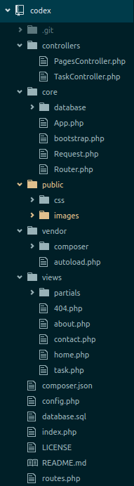

Codex [A raw PHP boilerplate application]
==========================================

#Description
  This application is just a ordinary web app written in PHP.
  But have good maintainable code structure and help to build
  web app in raw php rapidly. Its also help to understand about
  MVC framework terminology, How those framework works(CodeIgnitor,
  Laravel etc).

--Structure

#Installation
  Clone this repo and move to your LAMP,XAMP OR MAPP server.
  import "database.sql" file in phpmyadmin. Then open "config.php"
  and change database setting according to your need.

#Screenshot

#Licence
  This application is published under GPL-3.0
Enjoy :)
